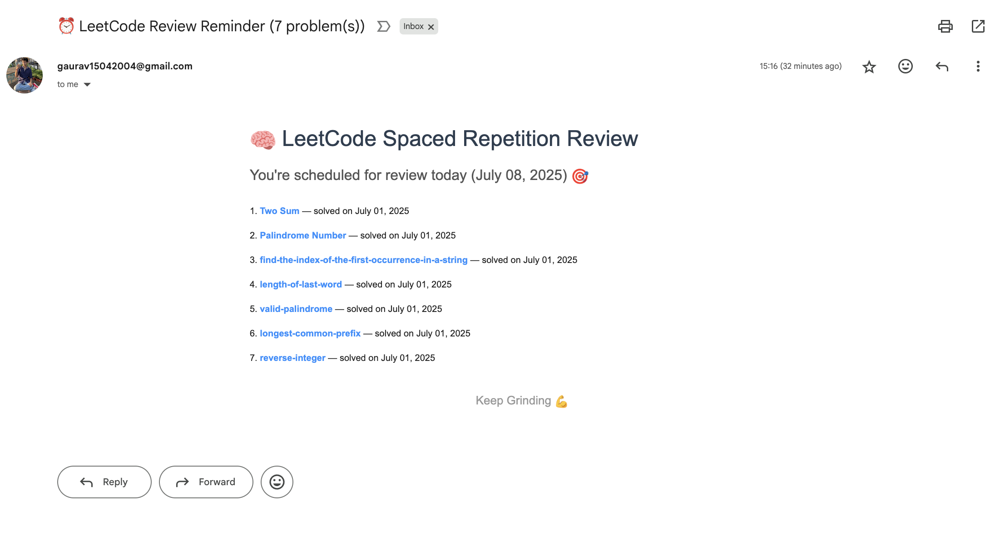

  <h1 style="font-size: 3em; color: #4CAF50; margin-bottom: 0.2em;">LeetAbhyas 🧠</h1>
  

  

    <strong>LeetAbhyas</strong> is a fully automated, elegant, and structured LeetCode submission tracker that integrates spaced repetition, delivering timely revision reminders via email.
  

  <blockquote><strong>🎯 Stay consistent, master DSA, and retain better — automatically.</strong></blockquote>

---

## ⚙️ Tech Stack

| 🧩 Tool              | 🔍 Role                                     |
|----------------------|----------------------------------------------|
| 🐍 Python            | Scripts for syncing & spaced reminders       |
| 🔁 GitHub Actions    | Automates everything daily                   |
| ⚙️ leetcode-export    | Fetches accepted submissions                 |
| ✉️ Gmail SMTP        | Sends HTML-rich spaced reminder emails       |
| 📚 Java              | Main language used for solving problems      |
| ☁️ Git + GitHub      | Organizes & hosts your practice efforts      |

---

## 🔁 Automation Workflow

---

## 📛 Submission Tracker Badge

The live badge above reflects the **current number of accepted problems**, automatically updated via a GitHub Actions badge renderer.

---

## 🧠 Spaced Repetition System

Enhance memory retention using science-backed review intervals:

| ⏰ Day | 💡 Stage               |
|--------|------------------------|
| 7      | Initial recall         |
| 15     | First reinforcement    |
| 30     | Medium-term retention |
| 60     | Long-term recall       |
| 90     | Final reinforcement    |

> 📬 Daily emails are generated automatically if any problems are due for review.

---

## ✨ Showcase Snapshot

> A sample of the beautifully formatted reminder email you’ll receive — rich HTML, clickable titles, solved dates, and intuitive layout.

---

## 🚀 Getting Started (Clone & Run)

> Build your revision system in 5 minutes:

1. **Fork this repo**
2. Go to: `Settings → Secrets → Actions` and add:
   - `LEETCODE_COOKIES`: Full LeetCode cookie string
   - `LEETCODE_USERNAME`: Your LeetCode handle
   - `EMAIL_USER`: Sender Gmail address
   - `EMAIL_APP_PASS`: App password for the Gmail
   - `TO_EMAIL`: Destination email address
3. Enable GitHub Actions
4. Done! 🎉 Your automated system is ready

---

## 👨‍💻 About Me

**Crafted with ❤️ by Gaurav Sharma**  
📧 gaurav15042004@gmail.com  
🎓 B.Tech Computer Engineering @ BVCOE Pune  
🔗 [@gaurav15042004 on GitHub](https://github.com/gaurav15042004)

---

  <em>“Consistency compounds.” – Naval Ravikant</em>

